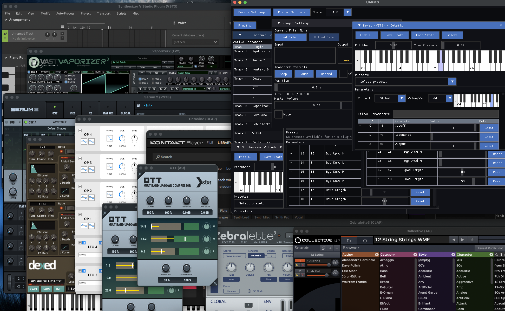

# UAPMD: Ubiquitous Audio Plugin MIDI Device



UAPMD is an audio plugin host that serves audio plugin instances as virtual MIDI 2.0 devices. Your can use arbitrary MIDI 2.0 client apps to:

- play MIDI 2.0 instruments with 32-bit precision; use Assignable Controllers (NRPNs) to change plugin parameters in 32-bit values (velocity in 16-bit).
- retrieve parameter list that are mapped to Assignable Controllers and Program List that are mapped to presets that are exposed via the plugin APIs. Thus you don't have to remember which controller index maps to the parameter you want, or which program number maps to the tone you need.
- save and load the plugin's state.

UAPMD targets macOS and Linux desktop. Windows builds are experimental and currently rely on the [Windows MIDI Services developer preview](https://github.com/microsoft/MIDI).

We support VST3, AudioUnit, LV2, and CLAP plugin formats.

UAPMD is based on its own plugin hosting foundation and released under the MIT license.

## Build or Install

There is an application `uapmd-app` that performs almost all features UAPMD provides.

### packages

`uapmd` offers Linux packages on the release pages and GitHub Actions build artifacts, in `.deb`, `.rpm` and `.tar.xz` (They are based on CPack packaging tasks). On macOS the `package` target generates a DMG image ready to distribute and the build also emits a standalone `uapmd-app.app` bundle you can drag to Applications. On Windows, running the same target produces a ZIP archive, and if [NSIS](https://nsis.sourceforge.io/Main_Page) is installed you also get a standard installer executable.

`uapmd` offers Homebrew package as well. You can install it as: `brew install atsushieno/oss/uapmd` then run `/opt/homebrew/bin/uapmd-app` or use those libraries the package offers.

### building from source

This `uapmd` Git repository provides the simple normative `cmake` build:

```
$ cmake -B build # -G Ninja
$ cmake --build build
$ cmake --install build # --prefix=/usr/local
```

### Windows MIDI Services support

Windows builds expect the Windows MIDI Services runtime to be available and use libremidi's WinMIDI backend. During configuration the build uses the NuGet package `Microsoft.Windows.Devices.Midi2.1.0.14-rc.1.209.nupkg` stored under `external/` and forwards it to libremidi as `LIBREMIDI_WINMIDI_HEADERS_ZIP`.

- `UAPMD_ENABLE_WINMIDI` (defaults to `ON` on Windows, `OFF` elsewhere) toggles this integration.
- Override `UAPMD_WINMIDI_HEADERS_ARCHIVE` if you want to point at a different package file.
- Set `LIBREMIDI_WINMIDI_HEADERS_ZIP` manually to a local `.nupkg` if you need offline builds; the automatic download is skipped when this variable is provided.


## Screenshots

I put them on the [wiki](https://github.com/atsushieno/uapmd/wiki) pages (note that other than the latest ones they are more like historical records).

## What's the point of these tools?

With UAPMD, You do not have to wait for MIDI 2.0 synthesizers in the market; existing audio plugins should work as virtual MIDI 2.0 devices. We have timidity++ or fluidsynth, Microsoft GS wavetable synth, YAMAHA S-YXG etc. for MIDI 1.0. UAPMD will take a similar place for MIDI 2.0.

Currently, both Remidy and UAPMD target only desktop platforms so far, but if you use my [AAP project](https://github.com/atsushieno/aap-core) those synth plugins already work as UMP devices (you need Android 15 or later that supports [`MidiUmpDeviceService`](https://developer.android.com/reference/kotlin/android/media/midi/MidiUmpDeviceService)).

## Usage

This repository contains one primary executable `uapmd-app`.

There are supplemental tools for diagnosing problems we encounter.

### uapmd-app

The virtual MIDI 2.0 device service controller. Currently the command line options are hacky:

> $ uapmd-app (plugin-name) (format-name) (api-name)

`plugin-name` is match by `std::string::contains()` within display name, case-sensitive.

`format-name` is one of `VST3` `AU`, `LV2`, or `CLAP`.

`api-name` so far accepts only `PIPEWIRE` (on Linux) to use PipeWire, and uses default available API otherwise.

### remidy-scan

`remidy-scan` is a tool to query and enumerate locally installed plugins, and stores the results to `(local app data)/remidy-tooling/plugin-list-cache.json` (`local app data` depends on the platform).

## Documentation

ALL docs under [`docs`](docs) are supposed to describe design investigation and thoughts.

We are moving quick and may not reflect the latest state of union, or describe our plans correctly.

There are some notable docs:

- [Plugin catalog (listing) and instantiation](docs/remidy/PLUGIN_ID_AND_CATALOG.md)
- [State](docs/remidy/STATE.md)
- [GUI support and main thread constraints](docs/remidy/GUI_SUPPORT.md)
- [Parameters](docs/remidy/PARAMETERS.md)
- [Presets](docs/remidy/PRESETS.md)

## Code modules

There are two primary libraries in this repository:

### remidy

`remidy` offers plugin API abstraction layer at lower level that primarily involves application agnostic audio and event processing. Apart from parameter API, it adopts UMP for event inputs, including parameter support via NRPN (AC, Assignable Controller) and Per-Note AC. It is an opinionated layer towards MIDI 2.0 i.e. events are parsed into timed parameter changes and other events on the plugins.

### remidy-tooling

`remidy-tooling` offers higher level API to build audio plugin hosting tools like plugin scanning and instancing in the common manner.
What this layer introduces in practice is a set of filters; various existing specific plugin products and vendors are filtered by "safe for multithreaded access to the plugin API," "plugin scanning requires the UI thread," or "crashes remidy" kind of information.

### uapmd

`uapmd` provides reusable foundation for constructing virtual MIDI 2.0 devices upon plugin hosting layer (only remidy so far). It serves `AllCtrlList` MIDI-CI standard property for plugin parameters as Assignable Controllers (NRPNs), `ProgramList` MIDI-CI standard property for the indexed presets as Program Change, and saves and loads states in MIDI-CI property manner.

### uapmd-app

`uapmd-app` is a plugin host that you can list the installed plugins, instantiate plugins, process audio with a UMP keyboard, adjust parameters, select presets, launch the GUI, save, and restore the states. It also exposes those plugins as platform virtual MIDI 2.0 devices, translating UMP inputs into event inputs to those in each plugin API, as well as exposing some plugin features using MIDI-CI property exchange.

It likely works with MIDI 1.0 inputs (translated, depending on the platform) to control plugins.


## License and Dependencies

Sources in this repository are released under the MIT license.

There are third-party (and first party) dependency libraries (git submodules, CMake FetchContent, or directly included):

- [lv2/lv2kit](https://github.com/lv2/lv2kit) (serd, sord, sratom, lilv, zix): the ISC license.
- [free-audio/clap](https://github.com/free-audio/clap) - MIT
- [free-audio/clap-helpers](https://github.com/free-audio/clap-helpers) - MIT
- [steinbergmedia/vst3sdk](https://github.com/steinbergmedia/vst3sdk) - MIT
- [Tracktion/choc](https://github.com/Tracktion/choc/): the ISC license.
  - [bellard/quickjs](https://github.com/bellard/quickjs) - MIT
  - [xiph/vorbis](https://github.com/xiph/vorbis) - BSD (3-clause)
  - [xiph/flac](https://github.com/xiph/flac) - BSD-like (libraries only)
- [celtera/libremidi](https://github.com/celtera/libremidi) - BSD (2-clause), MIT (RtMidi)
- [atsushieno/cmidi2](https://github.com/atsushieno/cmidi2) - MIT
- [atsushieno/midicci](https://github.com/atsushieno/midicci) - MIT
  - [zlib-ng/zlib-ng](https://github.com/zlib-ng/zlib-ng) - Zlib license.
- [mackron/miniaudio](https://github.com/mackron/miniaudio) - MIT (or public domain)
- [cginternals/cpplocate](https://github.com/cginternals/cpplocate): the MIT license.
- [jarro2783/cxxopts](https://github.com/jarro2783/cxxopts): the MIT license.
- [cameron314/concurrentqueue](https://github.com/cameron314/concurrentqueue) - BSD (2-clause)
- [cjappl/rtlog-cpp](https://github.com/cjappl/rtlog-cpp): the MIT license.
    - for submodules see their [LICENSE.md](https://github.com/cjappl/rtlog-cpp/blob/main/LICENSE.md) (modified BSD, MIT)
- [cpm-cmake/CPM.cmake](https://github.com/cpm-cmake/CPM.cmake) - MIT
- [ocornut/imgui](https://github.com/ocornut/imgui) - MIT
- [unevens/ImTimeline](https://github.com/unevens/ImTimeline) (a well-maintained and buildable fork of NickVanheer/ImTimeline) - MIT

Note that while they might look comprehensive, I'm listing those to clarify the licenses that matter. For example, libraries like choc depend on other third-party libraries but we don't use them.
