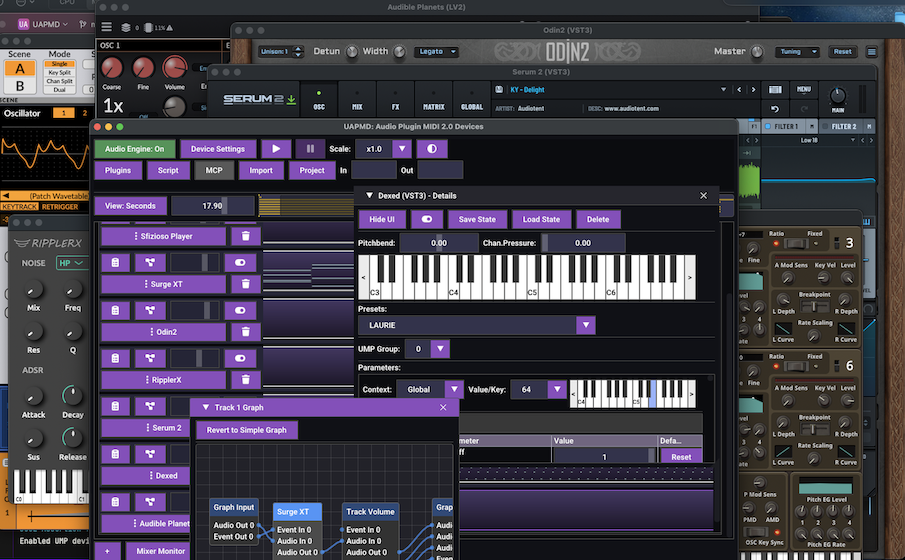
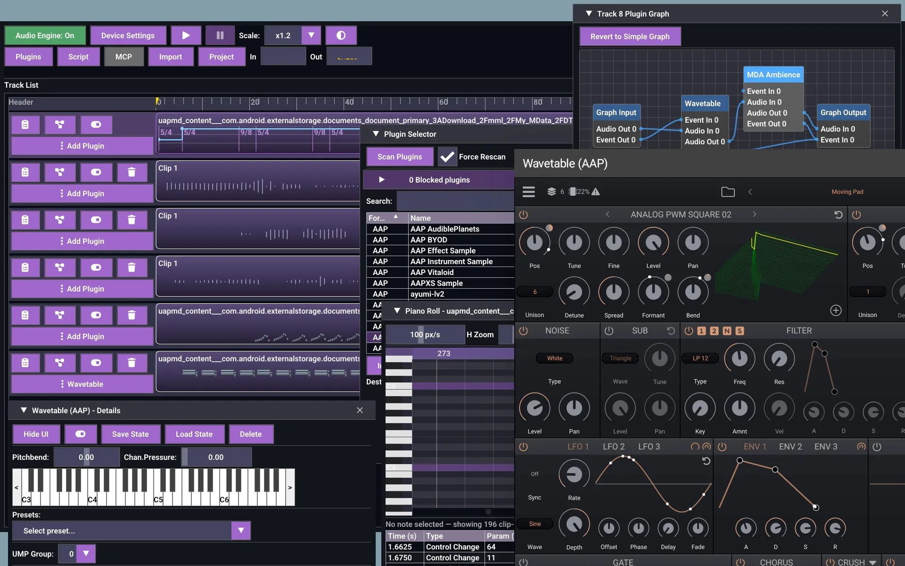

# UAPMD: a "MIDI 2.0 native" audio plugin hosting and DAW sequencer engine libraries




UAPMD (Ubiquitous Audio Plugin MIDI Device) is a music sequencer engine (library) with the following features and characteristics:

- **MIT-licensed**, with some exceptional opt-in features (e.g. ARA support module, under the Apache V2 license).
- **cross-platform**, including Android, Linux, and iOS.
- **ubiquitous plugin hosting**: provides cross-platform audio plugin hosting foundation with almost no dependency except for official SDKs (all under the MIT-compatible licenses).
- **complete MIDI 2.0 implementation**: builds upon its own MIDI 2.0 UMP and MIDI-CI processing library from scratch, including Flex Data, Mixed Data Set, as well as Process Inquiry. No other MIDI 2.0 library provides such complete feature sets.
- **MIDI2-native audio processor**: audio processing is done with UMP, which can bring in timestamps ("sample accurate") and parameter controllers in 32-bit resolution.
- **standard-based sequencer**: import SMF (either as a clip or split into tracks), MIDI 2.0 clips, audio recording (either as a clip or split into tracks using demucs.cpp or BSRoformer.cpp), and save/load them as a project.
- **audio warps** i.e. time-stretched audio clips.
- provides full access to the sequencer engine using **JavaScript API and MCP server**.
- implements various DAW engine features including fast plugin scanning without loading plugins, remote process plugin scanner, DAG, latency compensation, track freezing, and offline renderer.
- **highly modularized**: you can just take plugin hosting abstraction layer, virtual MIDI device hosting, project data format, sequencer engine, or up to the actual application layer.

It comes with a proof-of-concept application `uapmd-app` which runs as a desktop app, Android app, iOS app, or a webpage (app).

### UAPMD as a virtual MIDI 2.0 device host

UAPMD can expose audio plugins' control points as platform virtual MIDI 2.0 devices. Your can use arbitrary MIDI 2.0 client apps to:

- play MIDI 2.0 instruments with 32-bit precision; use Assignable Controllers (NRPNs) to change plugin parameters in 32-bit values (velocity in 16-bit).
- retrieve parameter list as Assignable Controllers and presets as Program List, as long as they are exposed via the plugin APIs. Thus you don't have to remember which controller index maps to the parameter you want, or which program number maps to the tone you need.
- save and load the plugin's binary state (`.vstpreset` etc.), just like how you use them in a DAW.

We also develop [midicci](https://github.com/atsushieno/midicci), an fully featured MIDI 2.0 software keyboard that leverages the full potential of this project.

### Supported audio plugin formats

UAPMD is unique in that it supports audio plugins on desktop, iOS, and Android.

| platform | plugin formats | missing features |
|-|-|-|
| Linux desktop | VST3,LV2,CLAP | |
| macOS | VST3,AU(v2/v3),LV2,CLAP | |
| Windows | VST3,LV2,CLAP | MIDI 2.0 virtual devices (WIP) |
| Android | [AAP](https://github.com/atsushieno/aap-core) | MIDI 2.0 virtual devices (but AAP itself supports it statically) |
| iOS | AUv3 | |
| Web (Emscripten) | [WebCLAP](https://github.com/WebCLAP) | |


## Screenshots

I put them on the [wiki](https://github.com/atsushieno/uapmd/wiki) pages (note that other than the latest ones they are more like historical records).

## What's the point of these tools?

v0.1: With UAPMD, You do not have to wait for MIDI 2.0 synthesizers in the market; existing audio plugins should work as virtual MIDI 2.0 devices. We have timidity++ or fluidsynth, Microsoft GS wavetable synth, YAMAHA S-YXG etc. for MIDI 1.0. UAPMD will take a similar place for MIDI 2.0.

v0.2: UAPMD works more like a multitrack sequencer that lets you organize audio and MIDI 2.0 clips with audio plugins, to play all together or record statically into audio files.

v0.3: UAPMD works everywhere on desktop, mobile, and web (virtual MIDI 2.0 devices as long as the platform is eligible).

v0.4 .. v0.5.x: it became a practical audio sequencer engine on Android and Web.


## Usage

This repository contains one primary executable `uapmd-app`.

There are supplemental tools for diagnosing problems we encounter.

### uapmd-app

It is the primary multitrack sequencer, virtual MIDI 2.0 device service controller. Currently the public command line options are hacky:

> $ uapmd-app (plugin-name) (format-name) (api-name)

`plugin-name` is match by `std::string::contains()` within display name, case-sensitive.

`format-name` is one of `VST3` `AU`, `LV2`, or `CLAP`.

`api-name` so far accepts only `PIPEWIRE` (on Linux) to use PipeWire, and uses default available API otherwise.

We have some [users guide documentation](docs/users/USERS_GUIDE.md).

### uapmd-scan

`uapmd-scan` is a standalone entry point for the scan-only mode that also powers `uapmd-app --scan-only`. It always performs a fresh rescan via the remote scanner worker (equivalent to `uapmd-app --scan-only --force-rescan --full --remote`), enforces per-bundle timeouts (`--timeout <seconds>`, default `120`) so that hung plugins are terminated and skipped, persists the cache to `(local app data)/remidy-tooling/plugin-list-cache.json` (`local app data` [depends on the platform](https://github.com/cginternals/cpplocate)), and prints the JSON report to stdout.

### uapmd-apply

`uapmd-apply` is an offline rendering engine for `*.uapmdz` project files. It instantiates all the plugins used in the project, then render a WAV without GUI. You can achieve the same functionality using `uapmd-app`.


## Build + Install

There is an application `uapmd-app` that performs almost all features UAPMD provides.

### app packages

`uapmd` offers Linux packages on the release pages and GitHub Actions build artifacts, in `.deb`, `.rpm` and `.tar.xz` (They are based on CPack packaging tasks). On macOS the `package` target generates a DMG image ready to distribute and the build also emits a standalone `uapmd-app.app` bundle you can drag to Applications. On Windows, running the same target produces a ZIP archive, and if [NSIS](https://nsis.sourceforge.io/Main_Page) is installed you also get a standard installer executable.

`uapmd` offers Homebrew package as well. You can install it as: `brew install atsushieno/oss/uapmd` then run `/opt/homebrew/bin/uapmd-app` or use those libraries the package offers.
Our package settings are stored at [atsushieno/homebrew-oss](https://github.com/atsushieno/homebrew-oss).

### building from source

This `uapmd` Git repository provides the simple normative `cmake` build:

```
cmake -B build -G Ninja -DCPM_SOURCE_CACHE=~/.cache/CPM/uapmd    # you can skip -DCPM_SOURCE_CACHE
cmake --build build
cmake --build build --target package # if you prefer package files
```

If you are using Windows:

```
cmake -B build -G "Visual Studio 17 2022" -DBUILD_SHARED_LIBS=OFF -DREMIDY_BUILD_CONFIG=Release -DUAPMD_ENABLE_WINMIDI=ON -DCPM_SOURCE_CACHE=%HOME%\.cache\CPM\uapmd    # you can skip -DCPM_SOURCE_CACHE
cmake --build build
cmake --build build --target package # if you prefer package files
```

After successful build on those desktop platforms, the artifacts are found like: `*.deb`, `*.rpm`, `*.tar.xz`, `uapmd-*.zip`, `*.exe`, or `*.dmg` (under `build` directory)

If you target Android:

```
cd android && ./gradlew build
```

If you target iOS:

```
bash build-ios-sim.sh CPM_SOURCE_CACHE=~/.cache/CPM/uapmd   # you can skip CPM_SOURCE_CACHE
```

If you target Web:

```
bash build-wasm.sh CPM_SOURCE_CACHE=~/.cache/CPM/uapmd   # you can skip CPM_SOURCE_CACHE
```

Then you can run it like:

```
npx http-server cmake-build-wasm/source/tools/uapmd-app
```


## Documentation

ALL docs under [`docs`](docs) are supposed to describe design investigation and thoughts.

We are moving quick and may not reflect the latest state of union, or describe our plans correctly.

There are some notable docs:

- [Developer's Guide](docs/DEVELOPERS.md)
- [Plugin catalog (listing) and instantiation](docs/remidy/PLUGIN_ID_AND_CATALOG.md)
- [State](docs/remidy/STATE.md)
- [GUI support and main thread constraints](docs/remidy/GUI_SUPPORT.md)
- [Parameters](docs/remidy/PARAMETERS.md)
- [Presets](docs/remidy/PRESETS.md)


## License and Dependencies

We have two distinct component sets for different licenses.

- The following modules are released under the Apache V2 license: [LICENSE.APACHE-2.0.txt](LICENSE.APACHE-2.0.txt) 
  - `uapmd-ara`
  - `uapmd-mir`
- Anything else in this repository are released under the MIT license. [LICENSE](LICENSE)

There are third-party (and first-party) dependency libraries (git submodules, CMake FetchContent, or directly included):

MIT/ISC/whatever compatible with them:

- [lv2/lv2kit](https://github.com/lv2/lv2kit) (serd, sord, sratom, lilv, zix): the ISC license.
- [free-audio/clap](https://github.com/free-audio/clap) - MIT
- [free-audio/clap-helpers](https://github.com/free-audio/clap-helpers) - MIT
- [steinbergmedia/vst3sdk](https://github.com/steinbergmedia/vst3sdk) - MIT
- [atsushieno/aap-core](https://github.com/atsushieno/aap-core) - MIT
- [WebCLAP/wclap-host-cpp](https://github.com/WebCLAP/wclap-host-cpp) - MIT
- [WebCLAP/wclap-host-js](https://github.com/WebCLAP/wclap-host-js) - MIT
- [Tracktion/choc](https://github.com/Tracktion/choc/): the ISC license.
  - [bellard/quickjs](https://github.com/bellard/quickjs) - MIT
  - [xiph/vorbis](https://github.com/xiph/vorbis) - BSD (3-clause)
  - [xiph/flac](https://github.com/xiph/flac) - BSD-like (libraries only)
- [celtera/libremidi](https://github.com/celtera/libremidi) - BSD (2-clause), MIT (RtMidi)
- [atsushieno/midicci](https://github.com/atsushieno/midicci) - MIT
- [mackron/miniaudio](https://github.com/mackron/miniaudio) - MIT (or public domain)
- [zlib-ng/zlib-ng](https://github.com/zlib-ng/zlib-ng) - Zlib license.
- [cginternals/cpplocate](https://github.com/cginternals/cpplocate): MIT
- [jeremy-rifkin/cpptrace](https://github.com/jeremy-rifkin/cpptrace) - MIT
- [jarro2783/cxxopts](https://github.com/jarro2783/cxxopts): MIT
- [cameron314/readerwriterqueue](https://github.com/cameron314/readerwriterqueue) - BSD (2-clause)
- [cameron314/concurrentqueue](https://github.com/cameron314/concurrentqueue) - BSD (2-clause)
- [cjappl/rtlog-cpp](https://github.com/cjappl/rtlog-cpp): MIT
  - [hogliux/farbot](https://github.com/hogliux/farbot) - MIT
  - [nothings/stb](https://github.com/nothings/stb) - MIT
  - [fmtlib/fmt](https://github.com/fmtlib/fmt) - MIT
- [ocornut/imgui](https://github.com/ocornut/imgui) - MIT
- [samhocevar/portable-file-dialogs](https://github.com/samhocevar/portable-file-dialogs) - WTFPL
- [triplejam/ImTimeline](https://github.com/triplejam/ImTimeline) (a well-maintained and buildable fork of NickVanheer/ImTimeline) - MIT
- [0aids/imnodes](https://github.com/0aids/imnodes/) (a well-maintained and buildable fork of Piratkopia13/imnodes) - MIT
- [juliettef/IconFontCppHelpers](https://github.com/juliettef/IconFontCppHeaders) - Zlib license.
- [eyalamirmusic/ResEmbed](https://github.com/eyalamirmusic/ResEmbed) - MIT
- [sevagh/demucs.cpp](https://github.com/sevagh/demucs.cpp) - MIT
- [sevagh/pitch-detection](https://github.com/sevagh/pitch-detection) (MPM and YIN pitch estimators) - MIT
- [mreineck/pocketfft](https://github.com/mreineck/pocketfft) - BSD (3-clause)
- [OpenMathLib/OpenBLAS](https://github.com/OpenMathLib/OpenBLAS) (optional for demucs.cpp acceleration; disabled by default) - BSD (3-clause) 
- [wang-bin/JMI](https://github.com/wang-bin/JMI) - MIT
- [yhirose/cpp-httplib](https://github.com/yhirose/cpp-httplib) - MIT
- [machinezone/IXWebSocket](https://github.com/machinezone/IXWebSocket) - BSD (3-clause)
- [Signalsmith-Audio/signalsmith-stretch](https://github.com/Signalsmith-Audio/signalsmith-stretch) - MIT
- [cpm-cmake/CPM.cmake](https://github.com/cpm-cmake/CPM.cmake) - MIT
- [google/googletest](https://github.com/google/googletest) - BSD (3-clause)
- [olilarkin/librosa.cpp](https://github.com/olilarkin/librosa.cpp) - ISC
- [chenmozhijin/BSRoformer.cpp](https://github.com/chenmozhijin/BSRoformer.cpp) - MIT
  - [ggml-org/ggml](https://github.com/ggml-org/ggml) (CPU backend only) - MIT

Fonts used:

- [Roboto font](https://fonts.google.com/specimen/Roboto) - the SIL Open Font License v1.1
- [FontAwesome](https://github.com/FortAwesome/Font-Awesome) - CC-BY 4.0 + SIL OFL 1.1
- [fontaudio](https://github.com/fefanto/fontaudio) - MIT

Apache V2 or compatible (opt-in features that have to be enabled using CMake options for each):

- [Celemony/ARA_SDK](https://github.com/Celemony/ARA_SDK) - Apache V2
- [libraz/libsonare](https://github.com/libraz/libsonare) - Apache V2
- [spotify/basic-pitch](https://github.com/spotify/basic-pitch) (ported note decoder; model weights downloaded at build time) - Apache V2

Note that while they might look comprehensive, I'm listing those to clarify the licenses that matter. For example, libraries like choc depend on other third-party libraries but we don't use them.
