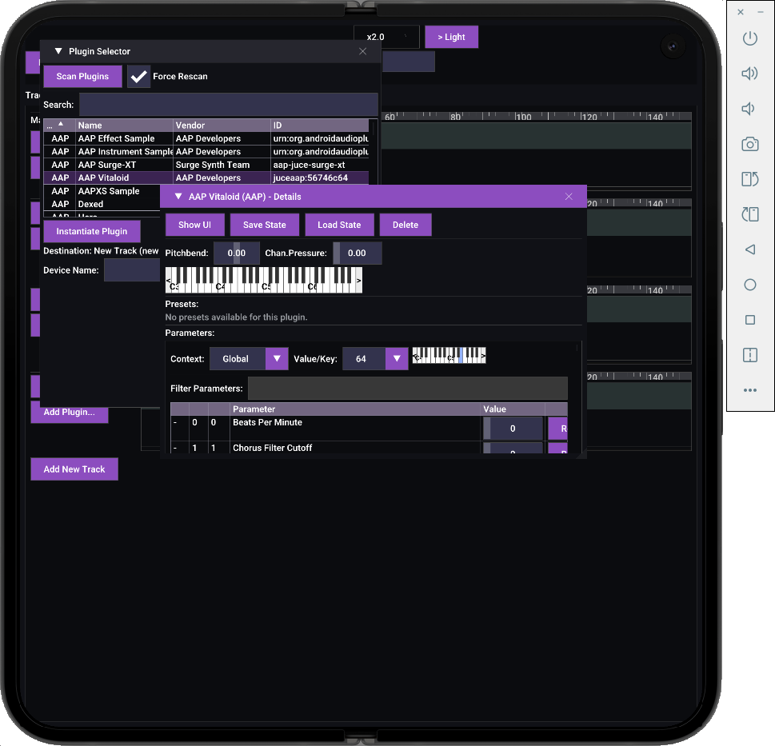

## AAP ARA support

Android ARA support uses the experimental AAP-native document API from
[aap-ara](https://github.com/atsushieno/aap-ara), alongside aap-core 0.12.0.
Check out the repositories at `android/external/aap-core` and
`android/external/aap-ara`, then publish their libraries before building UAPMD:

```sh
cd external/aap-core
./gradlew publishToMavenLocal
cd ../aap-ara
./gradlew :androidaudioplugin-ara:publishToMavenLocal
cd ../..
./gradlew assembleDebug
```

For an existing aap-core checkout elsewhere, pass `-PaapDir=/absolute/path/to/aap-core`
to the UAPMD Gradle build. The Android Actions workflow accepts `aap_core_ref`
and `aap_ara_ref` and checks out and publishes both dependencies automatically.

With the ARA support addin enabled, adding an AAP ARA plugin attaches the existing
plugin instance to the project. Audio clips, track sequences, clip moves, source
changes, and removal reach its document model; its usual plugin UI shows that same
document. Document synchronization and source access work with the audio engine off; enable
it for playback. Source reads use independent file readers on Binder threads. Plugin
content notifications queue rendered-track invalidation on the host event loop.
Modification archives are included in project save/load and clip/track clipboard
state when the plugin advertises archive support.

The current aap-ara API does not expose tempo/note content readers or analysis
requests, so those features remain unavailable for AAP. Timeline arrangement stays
host-owned, and audible ARA rendering depends on the plugin's AAP processing support.
