# uapmd-app UI Guide (AI slop)

NOTE: it is an AI-slop documentation where the screenshots are all taken at v0.5.6+. uapmd-app is a quickly moving target and the sshots will quickly get outdated. Please bear with that.

----

This is a screen-by-screen reference for `uapmd-app`, the ImGui-based reference host that ships
with UAPMD. It describes what each control does and where to find it.

For the wider picture -- what UAPMD is, how to obtain audio plugins on each platform, and what
source separation needs from you -- read [USERS_GUIDE.md](USERS_GUIDE.md) first. This document
assumes you already have the app running.

Screenshots were taken on macOS with the dark theme. Layout is identical on the other desktop
platforms; on Android, iOS and Web the same widgets are laid out for the available screen space.

- [Starting the app](#starting-the-app)
- [The main window](#the-main-window)
- [The toolbar](#the-toolbar)
- [The timeline](#the-timeline)
- [Tracks](#tracks)
- [Clips](#clips)
- [Clip editors](#clip-editors)
- [Plugins](#plugins)
- [Projects and rendering](#projects-and-rendering)
- [Settings](#settings)
- [Addins](#addins)
- [Automating the app](#automating-the-app)

## Starting the app

On desktop the executable takes a few optional arguments:

| Argument | Effect |
| --- | --- |
| `--scan-only` | Scan plugins and exit, without opening a window. |
| `--force-rescan` (or `--rescan`) | Discard the cached scan results and scan again. |
| `--full` | Perform full verification during the scan. Requires `--scan-only`. |
| `--mcp-server [port]` | Start the MCP server on launch. Defaults to port 37373. |
| `--no-confirm-on-quit` | Skip the "you have unsaved changes" dialog when closing. |

A positional argument is treated as a project file to load.

## The main window

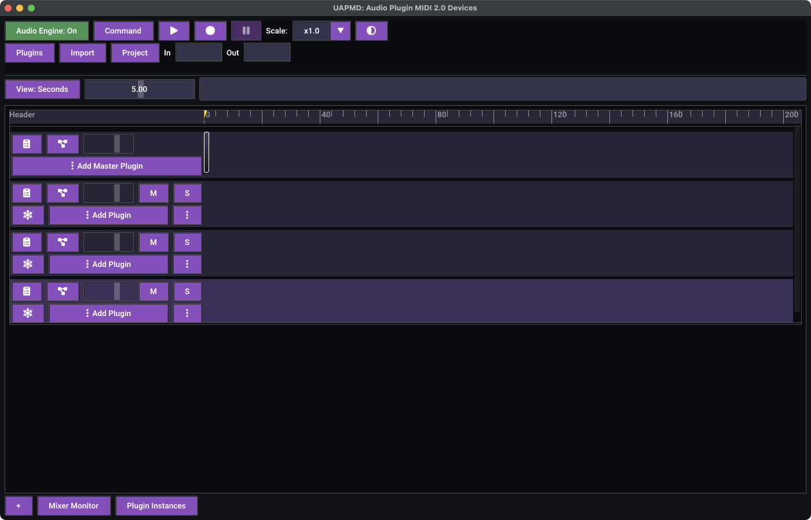

Everything lives in a single window with four bands, top to bottom:

1. **The toolbar** -- engine power, transport, global commands, display scale, theme.
2. **The navigator row** -- the time-unit switcher, the zoom slider, and the whole-song
   position controller.
3. **The track list** -- the master track followed by your tracks, each with a legend on the
   left and its clips on the right.
4. **The footer** -- add a track, and open the Mixer Monitor and Plugin Instances windows.

Auxiliary windows (Settings, Plugin Selector, editors, and so on) open as floating panels inside
the main window. They can be moved and resized like ordinary windows, and their positions are
remembered between runs.

At launch you get three empty tracks and an empty master track. Nothing is loaded and nothing is
playing, but the audio engine is already running.

## The toolbar

### Audio Engine

The leftmost button reports and toggles the audio engine. It is **green when on** and **red when
off**. Turning it off releases the audio device and disables the transport buttons; turning it
back on re-activates the device and the plugins on it.

### Command

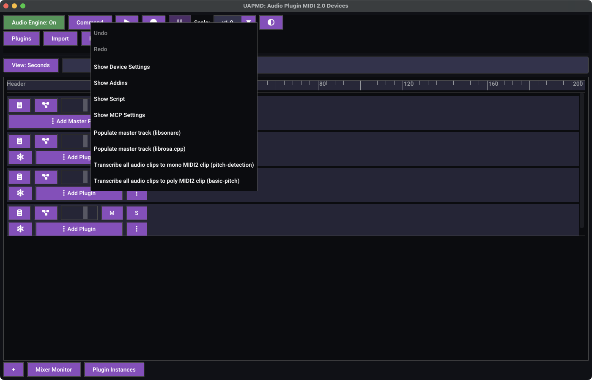

`Command` is the catch-all menu:

- **Undo / Redo** at the top, labelled with the operation they will reverse (for example
  "Undo Add track"). They are greyed out when there is nothing to undo, and a
  "History operation in progress..." note appears while one is still running.
  The keyboard shortcuts work anywhere outside a text field:
  `Ctrl+Z` / `Cmd+Z` to undo, `Ctrl+Shift+Z` / `Cmd+Shift+Z` or `Ctrl+Y` to redo.
- **Show / Hide Device Settings**, **Addins**, **Script**, and **MCP Settings** -- toggles for
  the four floating panels described later in this document.
- **Commands contributed by addins**, below the separator. What appears here depends on which
  addins are enabled; in the screenshot above they are master-track population (libsonare and
  librosa.cpp) and audio-to-MIDI transcription (pitch-detection for monophonic, basic-pitch for
  polyphonic material).

### Transport

Three buttons, all disabled while the audio engine is off:

| Button | Behaviour |
| --- | --- |
| Play / Stop | One button that shows a triangle when idle and a square while the transport is engaged. Stopping also cancels a paused state. |
| Record | Records into the **currently selected MIDI clip**. Select a clip on the timeline first, otherwise the button does nothing. It turns red while recording; press it again to stop. |
| Pause / Resume | Enabled only while the transport is engaged. Shows a pause glyph while playing and a play glyph while paused. |

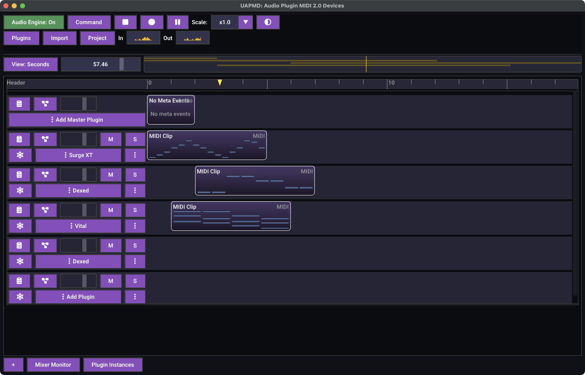

During playback the playhead marker moves along the ruler, a vertical line tracks it in the
position controller, and the two spectrum analyzers at the right end of the toolbar show input
and output activity.

### Scale and theme

`Scale:` picks the UI scale factor -- `x0.5`, `x0.8`, `x1.0`, `x1.2`, `x1.5`, `x2.0`, `x4.0`.
Changing it rescales every widget and font, and resizes the window to match. The button next to
it (a half-filled circle) switches between the dark and light themes.

### Plugins, Import, Project

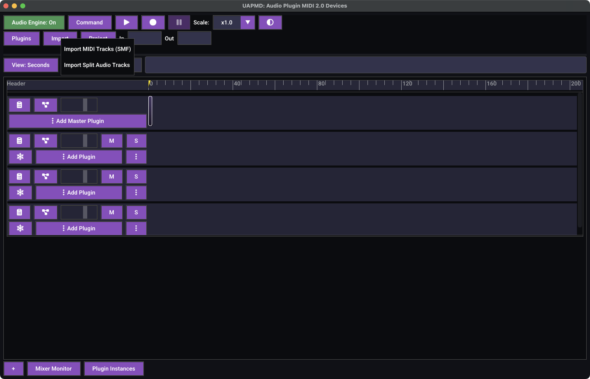

`Plugins` toggles the [Plugin Selector](#plugins). `Import` offers:

- **Import MIDI Tracks (SMF)** -- pick a MIDI 1.0 `.mid` file; each of its tracks becomes a
  track holding a MIDI 2.0 clip.
- **Import Split Audio Tracks** -- opens the split-audio import window. This item only appears
  while at least one stem separation addin is enabled.

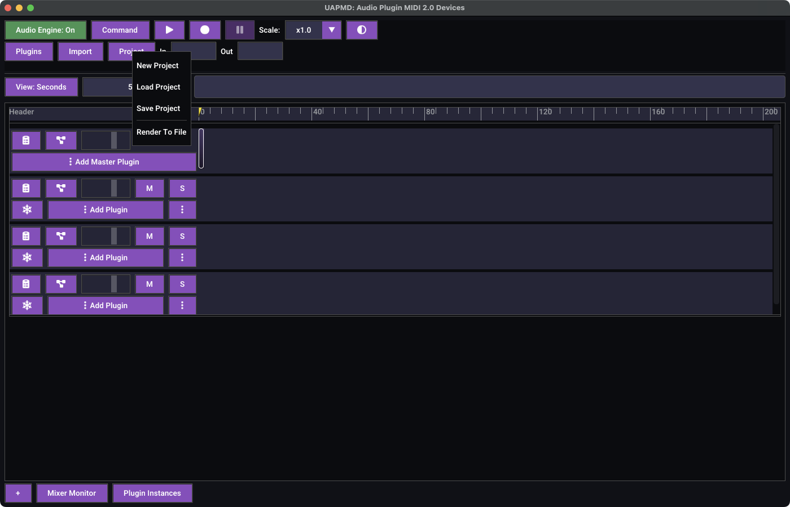

`Project` covers **New Project**, **Load Project**, **Save Project**, and
**[Render To File](#rendering-to-a-file)**. Starting a new project or closing the app while there
are unsaved changes prompts you first, unless you launched with `--no-confirm-on-quit`.

### Spectrum analyzers

`In` and `Out` at the right end are live spectrum displays of the audio input and the final
output bus.

## The timeline

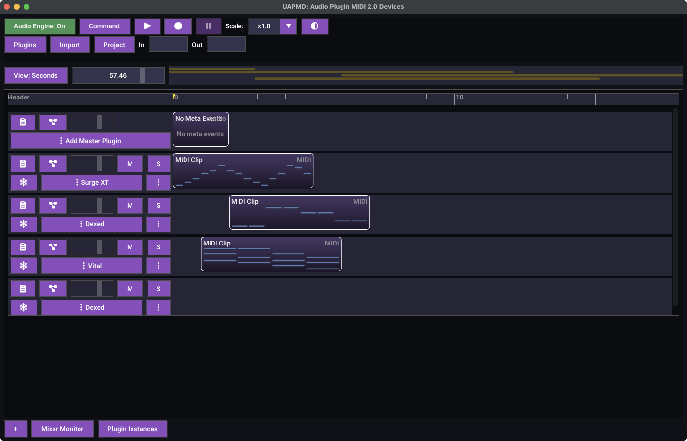

### Time units

The `View: Seconds` / `View: Beats` button switches the ruler and the clip positions between
absolute time and musical time. The two views are independent -- each keeps its own zoom.

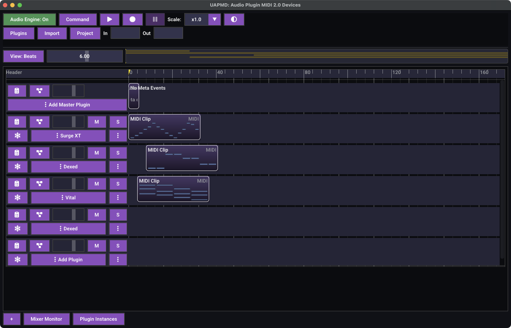

### Zoom and position

The slider next to the view switcher is the **timeline zoom**, showing pixels per unit. It is
logarithmic and spans four orders of magnitude, so small drags near the left end still move a
useful amount.

The wide bar filling the rest of the row is the **position controller**. It shows the entire
song: one lane per track, each clip a small bar, with a translucent rectangle marking the region
currently visible below. Drag it to scroll the track list.

### The master track

The first row is the master track. It carries the tempo and time-signature meta events that the
beats view is built from, and it can host its own plugin chain via **Add Master Plugin**. It has
a gain slider but no mute or solo.

### The footer

`+` adds an empty track. `Mixer Monitor` and `Plugin Instances` open the two windows described
below.

## Tracks

A track owns an audio plugin graph and a set of clips. It is not "a plugin" -- a track typically
holds one instrument plugin followed by zero or more effects, or, for audio material, just
effects.

Each track legend has two rows of controls.

**Row 1** -- clipboard icon, graph icon, gain slider, `M`, `S`:

| Control | Behaviour |
| --- | --- |
| Clipboard icon | Opens the [clip menu](#clips). |
| Graph icon | Shows or hides the [track graph editor](#the-track-graph-editor). |
| Gain slider | Track volume. Hovering shows the value in dB and as a linear factor; at the bottom of its travel it reads `Mute`. |
| `M` | Mute. Turns red while the track is muted. |
| `S` | Solo. Turns amber while soloed. `Ctrl`/`Cmd`-click to add a track to the current solo set instead of replacing it. |

**Row 2** -- snowflake icon, the plugin button, `⋮`:

| Control | Behaviour |
| --- | --- |
| Snowflake icon | Track freezing. Off by default; clicking renders the track and freezes it. While rendering the icon becomes a spinner and clicking cancels; a queued freeze shows amber and a completed one blue. If a freeze fails, the tooltip carries the error and clicking turns the policy off. |
| Plugin button | Shows the name of the track's first plugin, or `Add Plugin` when the track is empty. Opens the [plugin menu](#the-plugin-menu-on-a-track). |
| `⋮` | More track actions. |

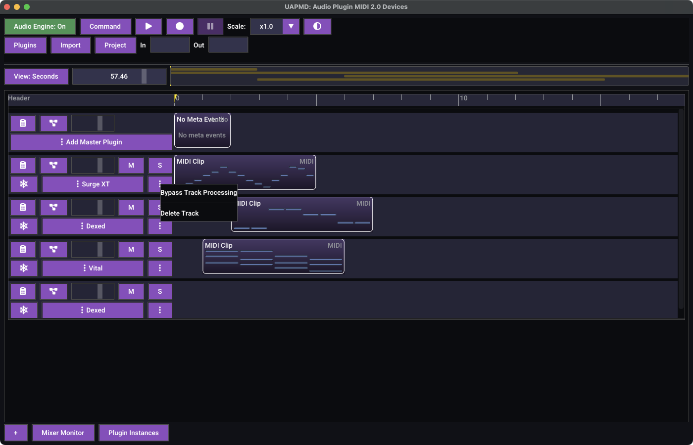

The `⋮` menu holds the two actions that are destructive or easy to hit by accident:
**Bypass Track Processing** (which stops the track's plugins from processing while leaving them
loaded) and **Delete Track**.

Most of these controls are disabled while a track is busy -- for example while a freeze render
is running.

## Clips

A track can hold both audio and MIDI 2.0 clips at the same time. On playback both are fed into
the track's graph, sliced per sample block. The usual reason to mix them is automation: an audio
clip carrying the material, plus a MIDI 2.0 clip carrying Assignable Controllers that drive the
effect plugins.

### The clip menu

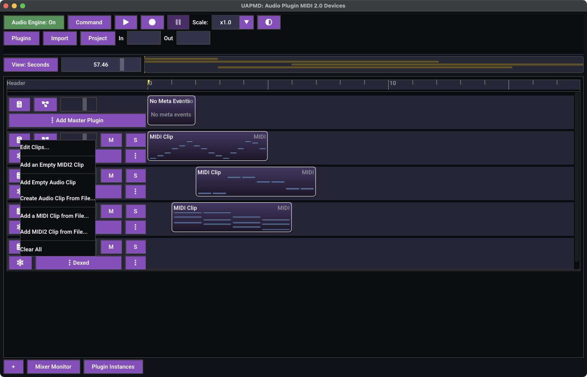

The clipboard icon in the track legend opens the clip menu, which applies to the track as a
whole:

- **Edit Clips...** -- opens the per-track clip editor window.
- **Add an Empty MIDI2 Clip** / **Add Empty Audio Clip**.
- **Create Audio Clip From File...** -- `.wav`, `.ogg`, `.flac`.
- **Add a MIDI Clip from File...** -- a MIDI 1.0 `.mid` file, translated to MIDI 2.0.
- **Add MIDI2 Clip from File...** -- a MIDI 2.0 clip file (`.midi2`).
- **Clear All** -- removes every clip on the track, after a confirmation.

The master track offers the same menu minus the audio-clip and `Clear All` entries.

### Acting on one clip

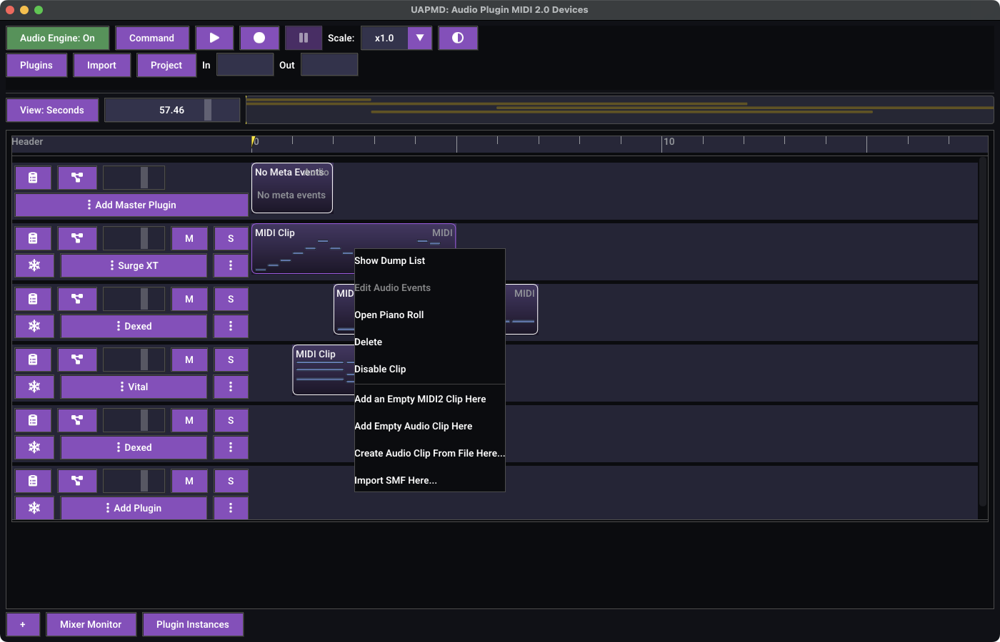

**Double-click a clip** on the timeline to select it and open its context menu:

- **Show Dump List** -- the [MIDI event list editor](#the-midi-event-list).
- **Edit Audio Events** -- the audio marker and warp editor. Enabled for audio clips only.
- **Open Piano Roll** -- the [piano roll editor](#the-piano-roll).
- **Delete** and **Disable Clip**.
- **Add an Empty MIDI2 Clip Here**, **Add Empty Audio Clip Here**,
  **Create Audio Clip From File Here...**, **Import SMF Here...** -- these use the timeline
  position you double-clicked as the new clip's start.

Double-clicking empty space in a track row opens the same "add here" entries without the
clip-specific ones.

## Clip editors

### The piano roll

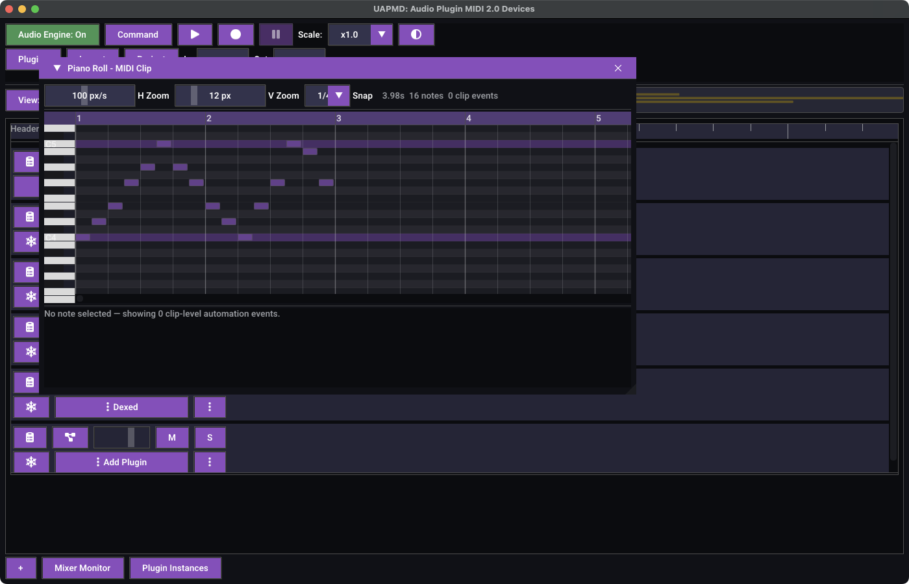

The piano roll edits the notes of a MIDI 2.0 clip. Its toolbar carries `H Zoom` in pixels per
second, `V Zoom` as the height of one semitone row, and a `Snap` division. The header also
reports the clip length, the note count, and how many clip-level events it holds.

Selecting a note fills the lower pane with that note's per-note events, where you can insert an
event before the selected one, edit its type and value, or delete it. With no note selected the
pane lists the clip-level automation events instead.

### The MIDI event list

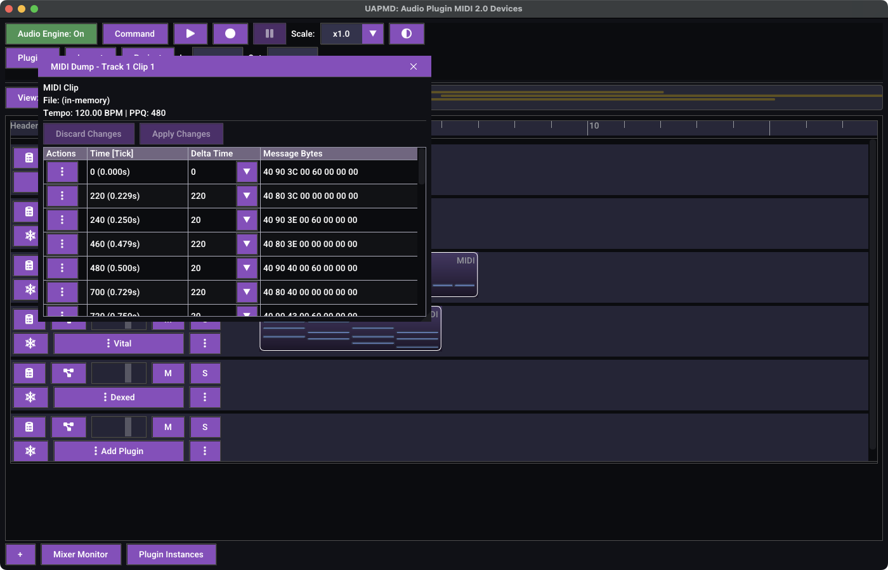

The dump list is the raw view of the same clip: one row per UMP, with its tick position, its
absolute time, its delta from the previous event, and its message bytes. The example above shows
MIDI 2.0 note-ons and note-offs (`40 90 3C 00 60 00 00 00` is a note-on for note 60).

Edits here are staged, not applied immediately -- change what you need, then **Apply Changes**,
or **Discard Changes** to reload the clip as it stands. The `⋮` button on each row inserts an
event before it or deletes it.

### Audio events

For audio clips, **Edit Audio Events** opens an editor for the clip's **markers** and **warps**.
Markers name a position in the clip; warps map a position in the clip to a position on the
timeline. Both are edited as lists, with `Add Marker` / `Add Warp`, and applied with `Apply`.

## Plugins

### Finding and loading plugins

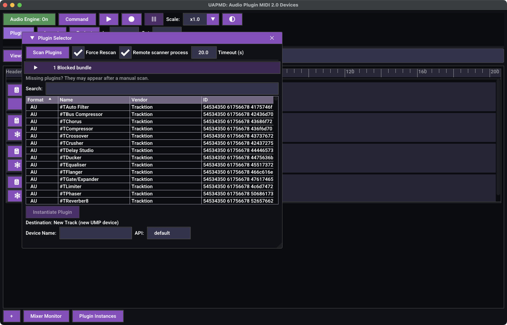

The `Plugins` button opens the Plugin Selector. UAPMD always performs a *fast* scan at startup,
which discovers plugins without instantiating them -- this covers CLAP, LV2, AUv2, AUv3, and
those VST3 bundles that ship a `moduleinfo.json`.

Everything else needs a real scan, which is what **Scan Plugins** does. Two checkboxes control
it: **Force Rescan** discards the cached results, and **Remote scanner process** runs the scan
in a separate process on desktop, so that a plugin which crashes on load cannot take the app
down with it. `Timeout (s)` bounds how long a single bundle may take.

Bundles that failed are collected under **Blocked bundles**, which expands to list them and
offers `Clear blocklist`, `Show scan report`, `Copy as Markdown`, and a table preview.

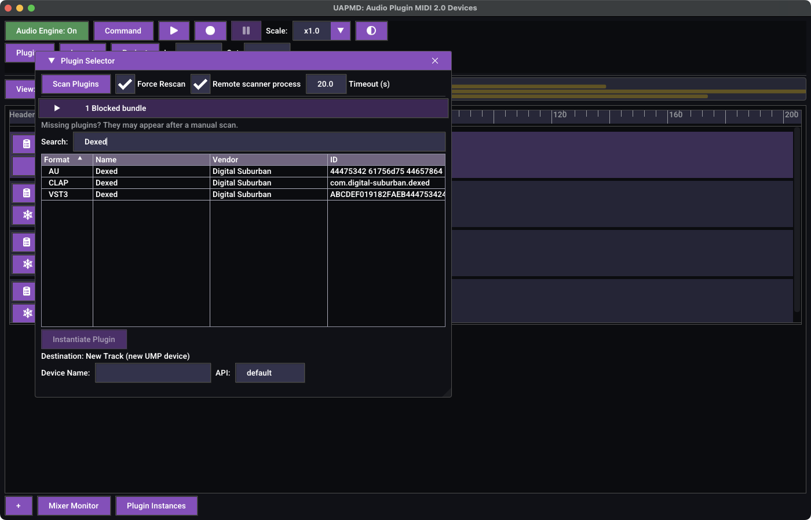

`Search:` filters the table, which sorts by format, name, vendor, or ID. Select a row and press
**Instantiate Plugin**.

**Destination** below the button says where the plugin will go. It reads
`New Track (new UMP device)` by default; opening the selector from a track's `Add Plugin` entry
instead targets that track, and from the master track's entry it targets the master track. When
a new track is created you can give its virtual UMP device a name and pick the MIDI API to
expose it on.

### The plugin menu on a track

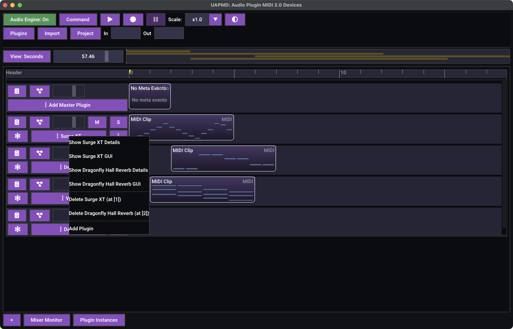

The plugin button in a track legend lists every plugin instance on that track, each with:

- **Show / Hide `<name>` Details** -- the instance details window.
- **Show / Hide `<name>` GUI** -- the plugin's own editor. Disabled when the plugin has no GUI.
- **Delete `<name>` (at [n])** -- `n` is the plugin's position in the chain.

**Add Plugin** at the bottom opens the Plugin Selector targeting this track, appending to the
chain.

### Instance details

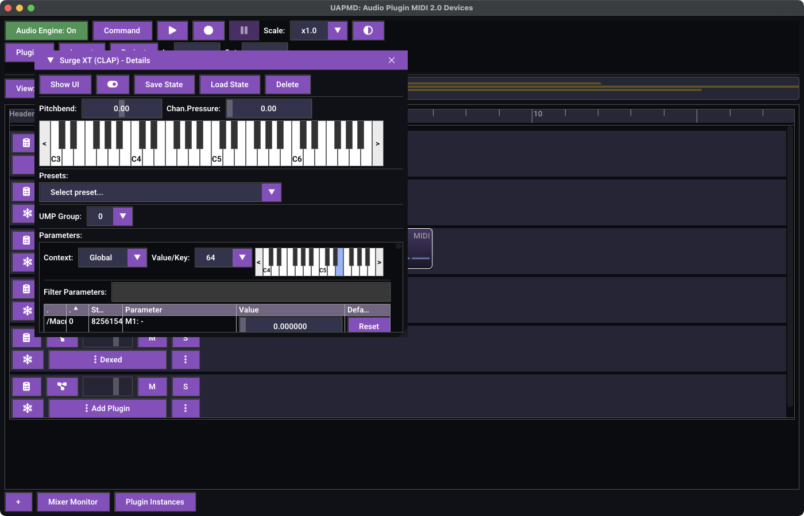

The details window is a playground for one plugin instance:

- **Show UI** opens the plugin's own editor, and the toggle next to it bypasses the instance.
- **Save State** / **Load State** write and read the plugin's own state.
- **Delete** removes the instance from the track.
- **Pitchbend** and **Chan.Pressure** sliders, and a **MIDI keyboard** you can click to audition
  the plugin.
- **Presets** lists the presets the plugin reports; selecting one loads it.
- **UMP Group** picks which UMP group of the track's virtual MIDI device drives this instance.
  Groups already in use are disabled.
- **Parameters** lists every parameter with its current and default value and a `Reset` button.
  `Context` and `Value/Key` narrow the list to per-note or per-key parameters where the plugin
  supports them, and `Filter Parameters` is a text filter over the names.

### The plugin GUI

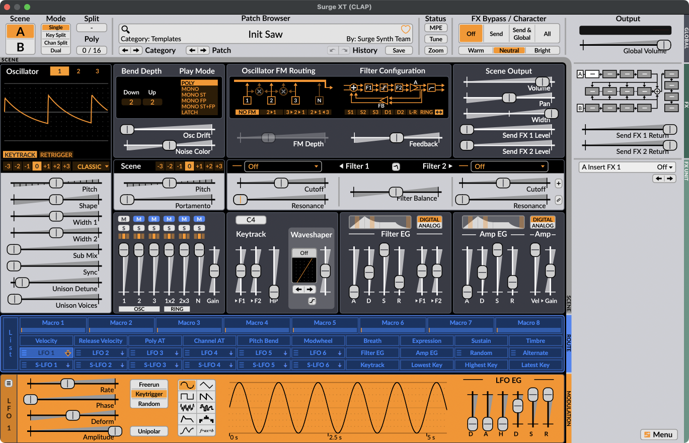

Plugin editors open as dedicated native windows, sized to whatever the plugin asks for and
resized along with it when the plugin requests a new size.

### The track graph editor

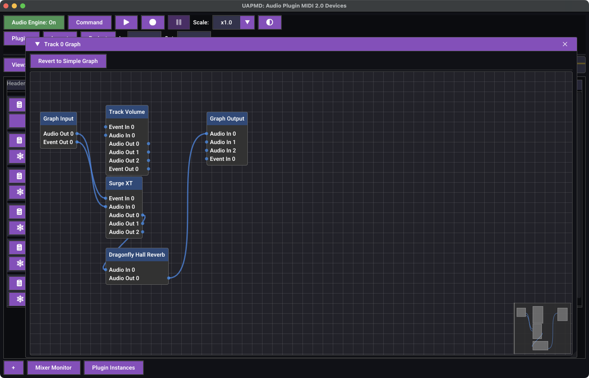

The graph icon in a track legend opens that track's audio graph. Nodes are the graph input, the
built-in track volume node, each plugin instance, and the graph output; edges are audio and
event connections. Ports are listed per node, so a plugin's channel layout is visible directly.

A track starts as a simple chain, and editing the connections turns it into a general DAG.
**Revert to Simple Graph** puts it back to a plain chain. A minimap in the corner helps when the
graph outgrows the window.

### Plugin instances

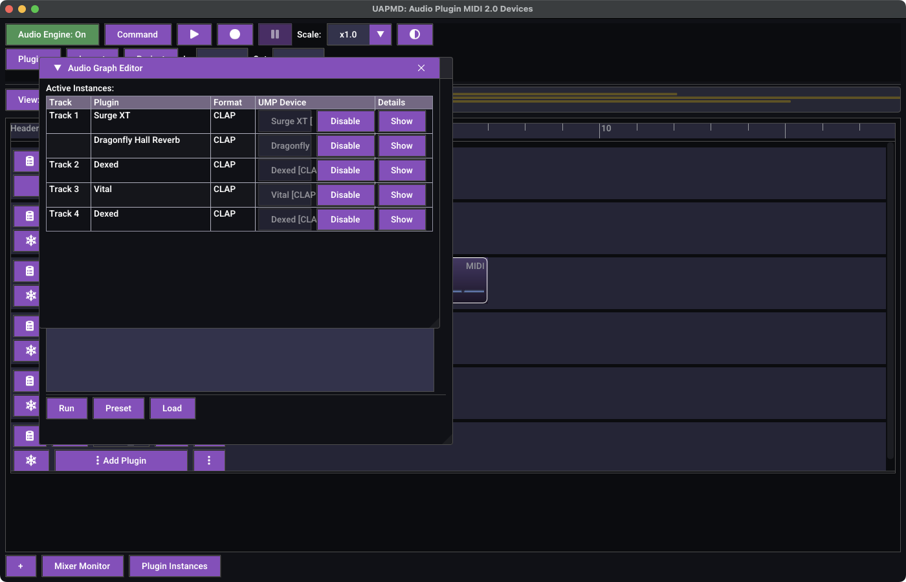

`Plugin Instances` in the footer opens a flat list of every plugin instance in the project,
grouped by track, showing the format and the virtual UMP device each is exposed as. `Disable`
bypasses an instance and `Show` opens its details window.

Note that this window lists plugin *instances*, not tracks -- one track with two plugins appears
as two rows.

### The mixer monitor

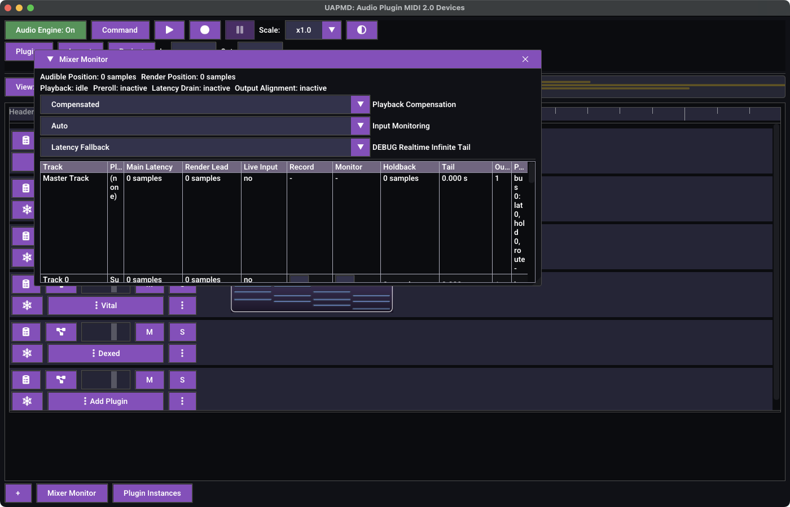

The Mixer Monitor reports latency compensation. The header shows the audible and render
positions and the current playback phase; below it, `Playback Compensation` and `Input
Monitoring` select the compensation strategy, and the table breaks down each track's reported
latency, render lead, holdback, tail, and routing.

## Projects and rendering

A project saves the tracks, their audio and MIDI 2.0 clips, and the plugin graphs with their
state. **Save Project** and **Load Project** live in the `Project` menu, along with **New
Project**, which resets to the launch state after prompting about unsaved changes.

### Rendering to a file

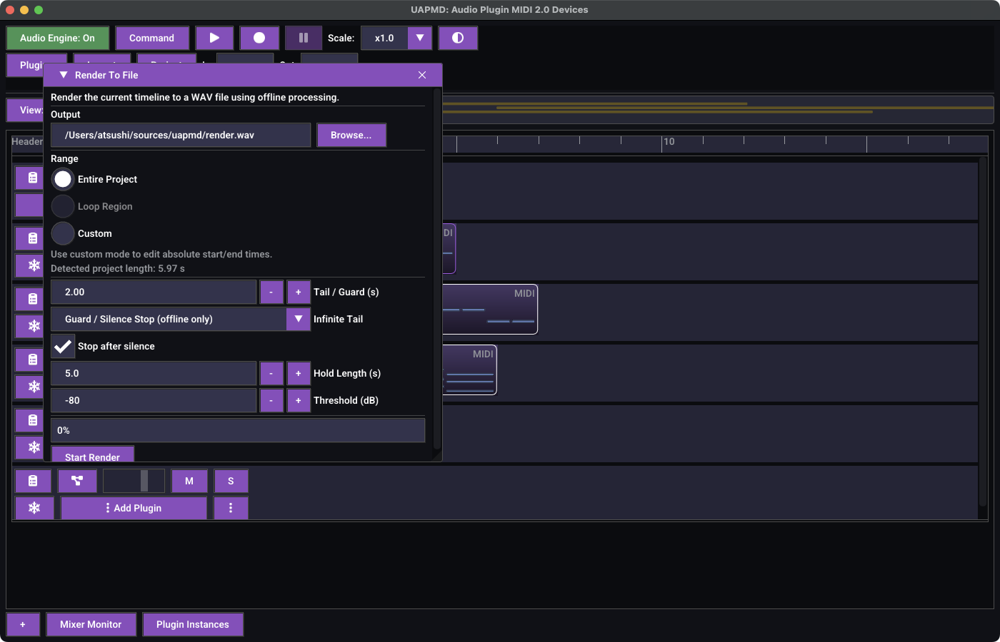

**Render To File** renders the timeline to a WAV file using offline processing -- faster than
real time, and independent of the audio device.

- **Output** is the target path; `Browse...` opens a file dialog.
- **Range** is `Entire Project`, `Loop Region`, or `Custom`. The detected project length is shown
  underneath, and `Custom` lets you type absolute start and end times.
- **Tail / Guard (s)** extends the render past the end of the material, so reverb tails are not
  cut off.
- **Infinite Tail** decides what to do with plugins that never fall silent.
- **Stop after silence**, with **Hold Length (s)** and **Threshold (dB)**, ends the render once
  the output has stayed below the threshold for that long.

A progress bar sits above **Start Render**, which becomes a stop button while a render runs.

## Settings

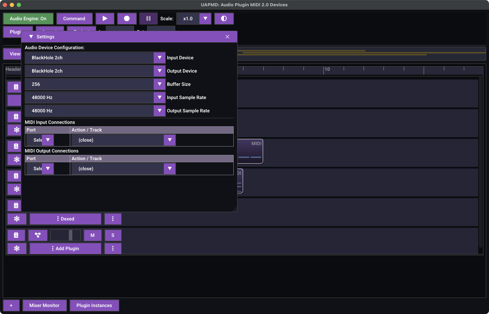

`Command` -> `Show Device Settings` opens audio and MIDI configuration:

- **Input Device** and **Output Device**, with their **Sample Rate** selectors.
- **Buffer Size**, or `Use Platform Buffer Size` to let the platform decide.
- **MIDI Input Connections** and **MIDI Output Connections** -- each row binds a platform MIDI
  port to a track, so you can play a track from external hardware or send its output out.

Changing the audio device restarts the engine, which reactivates every loaded plugin.

## Addins

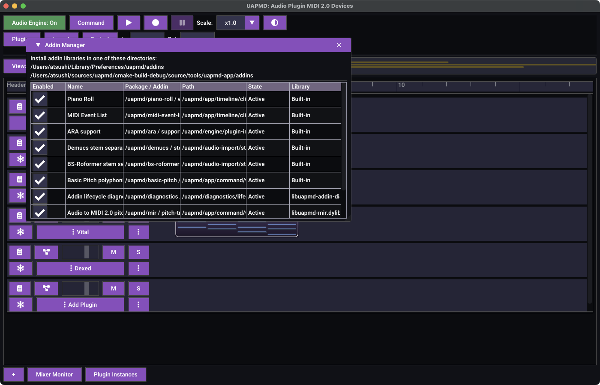

Several features are addins rather than built-in code, and the Addin Manager lists them all with
their package ID, the extension point they implement, their state, and the library they come
from. The checkbox in the first column enables or disables each one.

Addins ship built-in (the piano roll, the MIDI event list, ARA support, the Demucs and
BS-Roformer stem separators, Basic Pitch), or come from a shared library placed in one of the
directories named at the top of the window.

Disabling an addin removes what it contributes -- turn off both stem separators, for example,
and `Import Split Audio Tracks` disappears from the `Import` menu.

## Automating the app

Everything the UI does is also reachable programmatically, which is how UAPMD is meant to be
driven for anything repetitive.

### The script editor

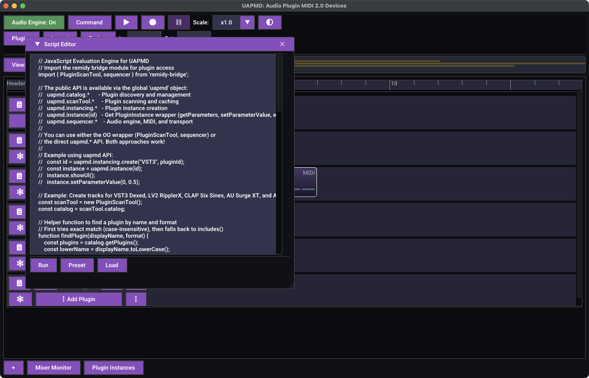

`Command` -> `Show Script` opens a JavaScript editor with `Run` and `Load`, plus `Preset` with
the bundled `Demo`, `PluginState`, and `TestDAG` scripts. The demo script documents the API:

| Object | Covers |
| --- | --- |
| `uapmd.catalog.*` | Plugin discovery and management |
| `uapmd.scanTool.*` | Plugin scanning and caching |
| `uapmd.instancing.*` | Plugin instance creation |
| `uapmd.instance(id)` | A plugin instance -- `getParameters`, `setParameterValue`, `showUI` |
| `uapmd.sequencer.*` | Audio engine, MIDI, and transport |

There is also an object-oriented wrapper (`PluginScanTool`, `sequencer`) imported from
`remidy-bridge`; both styles work.

### MCP

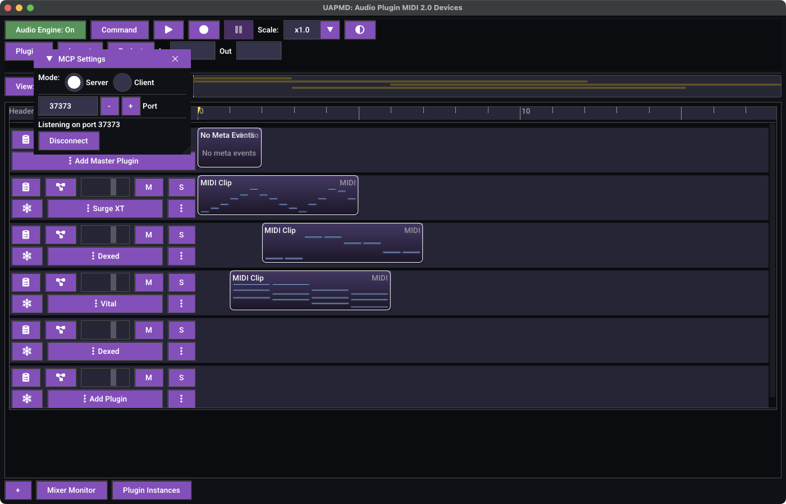

`Command` -> `Show MCP Settings` exposes the app as an MCP server, so an agent can inspect and
edit the project.

- **Server** mode listens on a port on `127.0.0.1` -- desktop only.
- **Client** mode connects out to a relay over WebSocket, with an optional auto-reconnect. This
  is the default on platforms without an embedded HTTP server.

Press **Connect** to start and **Disconnect** to stop; the status line above the button reports
what it is doing. Launching with `--mcp-server [port]` starts server mode without visiting this
window.

The tool surface covers tracks (`list_tracks`, `create_track`, `add_plugin_to_track`), clips
(`list_clips`, `add_midi_clip`, `create_empty_midi_clip`, `add_ump_event`, `remove_ump_event`),
transport (`play`, `stop`, `jump`, `set_tempo`), the graph (`connect_track_graph`,
`ensure_dag_track_graph`, `revert_track_graph_to_simple`), history (`undo`, `redo`,
`begin_compound`, `end_compound`), projects (`save_project`, `load_project`), presets, freezing,
latency compensation state, and `run_script` for the JavaScript API above.

On the Web build MCP is always active as a JavaScript export instead, called through
`Module.ccall('uapmd_mcp_call', ...)`, with `Module.ccall('uapmd_eval', ...)` for scripts.
