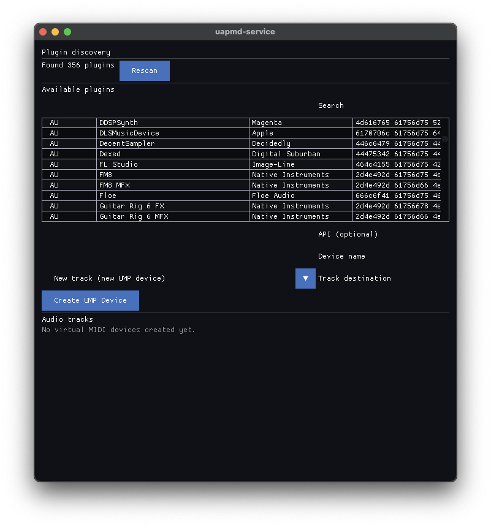
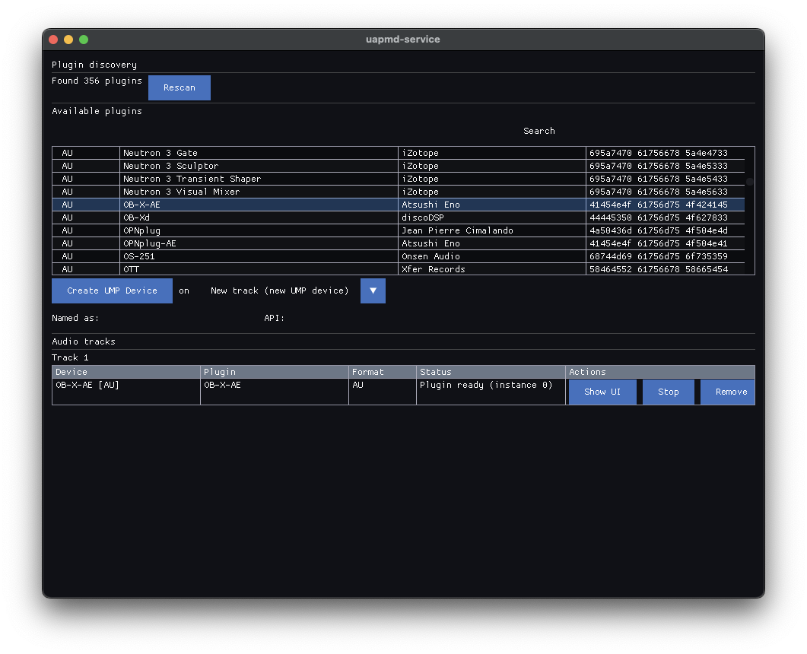
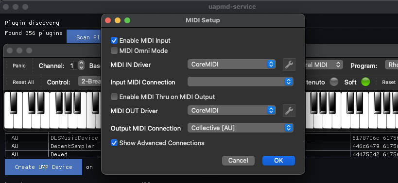
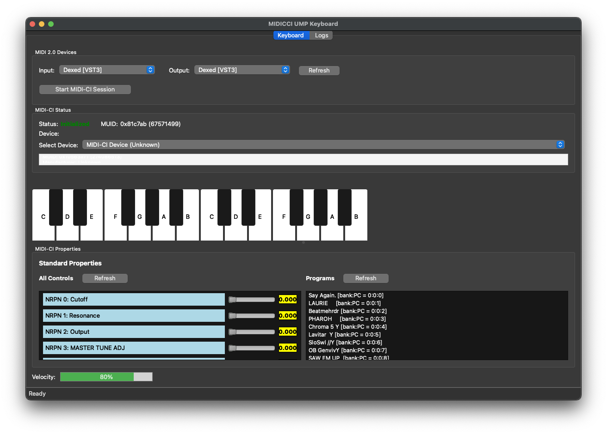

# How to make use of MIDI 2.0 apps with uapmd-service

uapmd-service is a standalone desktop application that lets you pick up audio plugins and register them as virtual MIDI 2.0 UMP devices.

## General Notes

Please bear in mind that UAPMD is still under heavy development. There are many things that do not work as expected. It is poorly tested (there is no decent testable environment that sets up plugins on the CI server). Various crashers.

Somehow (against @atsushieno's desire) things tend to work better on macOS, especially when it comes to platform MIDI features.

## Step 1: set up audio plugins you want to use

uapmd-service makes use of audio plugins in VST3/AU/LV2/CLAP format, so just install whatever you would like to use. There may be plugins that do not work with uapmd-service, but it's hard to tell in prior.

You can find some open source audio plugins by using [StudioRack](https://studiorack.github.io/studiorack-site/) (just note that there are instrument files that uapmd-service does not directly support).

## Step 2: create your virtual device

Run uapmd-service and "Scan Plugins" then the app main window would look like this:

Select a plugin and "Create UMP Device". It will add a new audio track:

## Step 3: Connect your app as a client

Those devices show up if your platform supports virtual MIDI 2.0 devices:

- Windows: N/A as [Windows MIDI Services](https://github.com/microsoft/MIDI) is not available on the platform yet.
- macOS: they will show up either as MIDI 1.0 or MIDI 2.0 devices via CoreMIDI
- Linux: if you specify PIPEWIRE as the MIDI API, they will show up to its
  client. Otherwise, they show up as UMP devices to ALSA sequencer.

Note the behavioral differences between macOS and Linux. On Linux there is
no automatic converted registration to MIDI 1.0 devices list. Only MIDI 2.0
clients list them. There are not many.

For example, if you launch [VMPK](https://vmpk.sourceforge.io/) on macOS (which supports automatic translation to MIDI 1.0 from UMP) and configure MIDI connection, there is a new MIDI device:

Now you can play your audio plugin as a MIDI device.

(Note that VMPK is a MIDI 1.0 application that does not find UMP devices on Linux.)

If you want to try UMP keyboard on Linux, you can try my `midicci-keyboard` app from [atsushieno/midicci](https://github.com/atsushieno/midicci/) GitHub repo (note that you'll have to build it from source).

It can retrieve parameters metadata and presets from the UMP device too, but is a bit complicated to use though; select both input and output device (from the same plugin), "Start MIDI-CI Session" and "Refresh" All Control and/or Programs.

IF everything works well, you'll see like this:

Note that changing parameter values and selecting presets are very unlikely to work fine yet.
