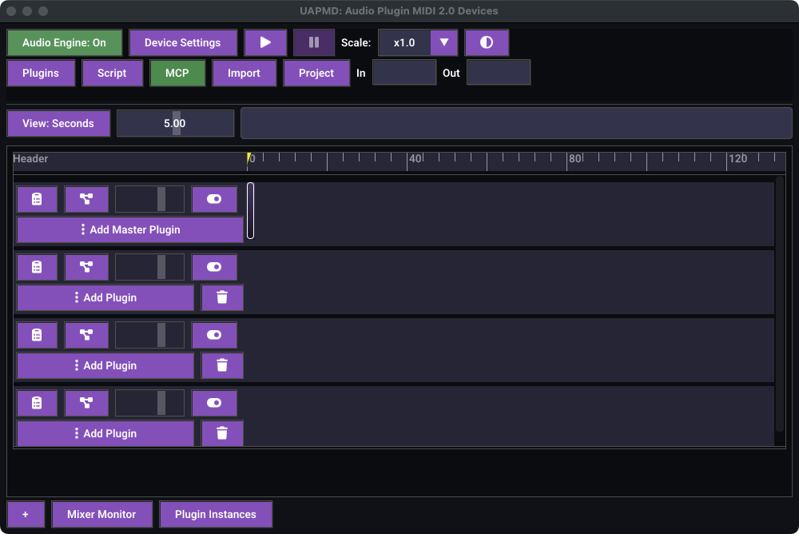
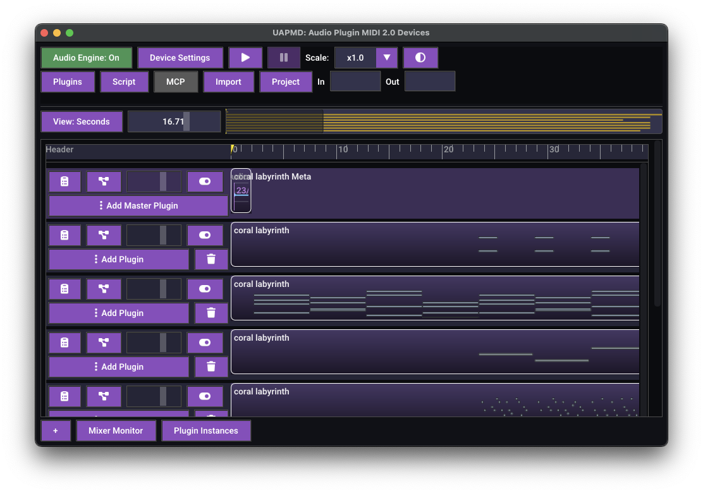
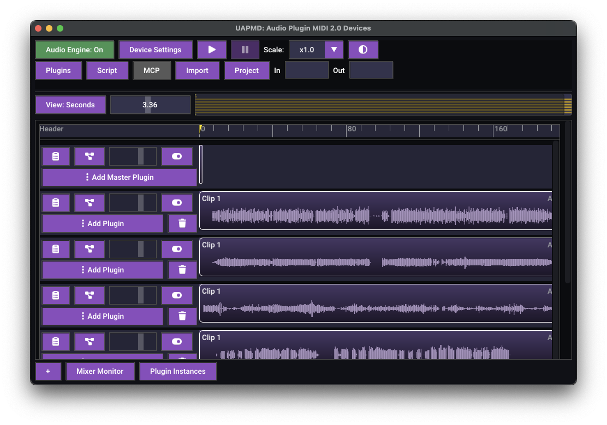
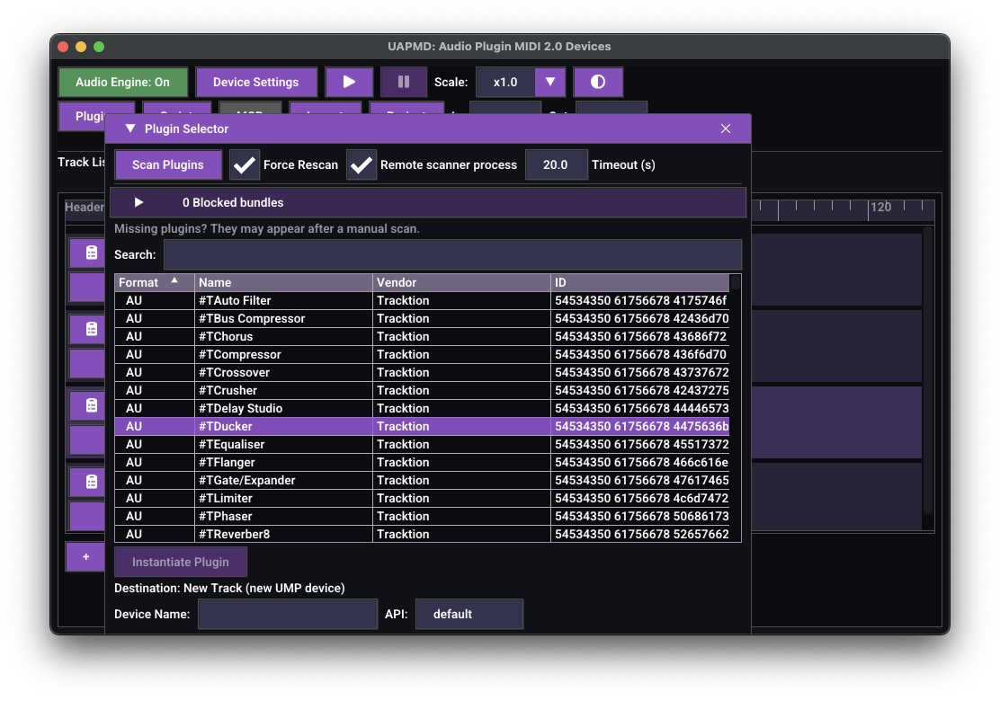
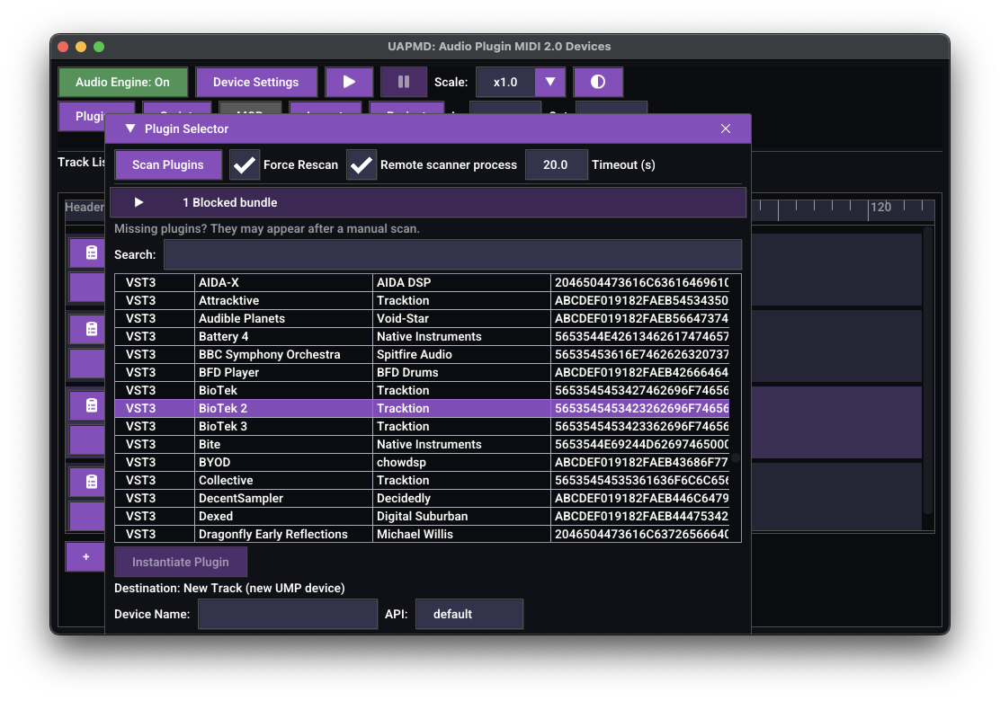
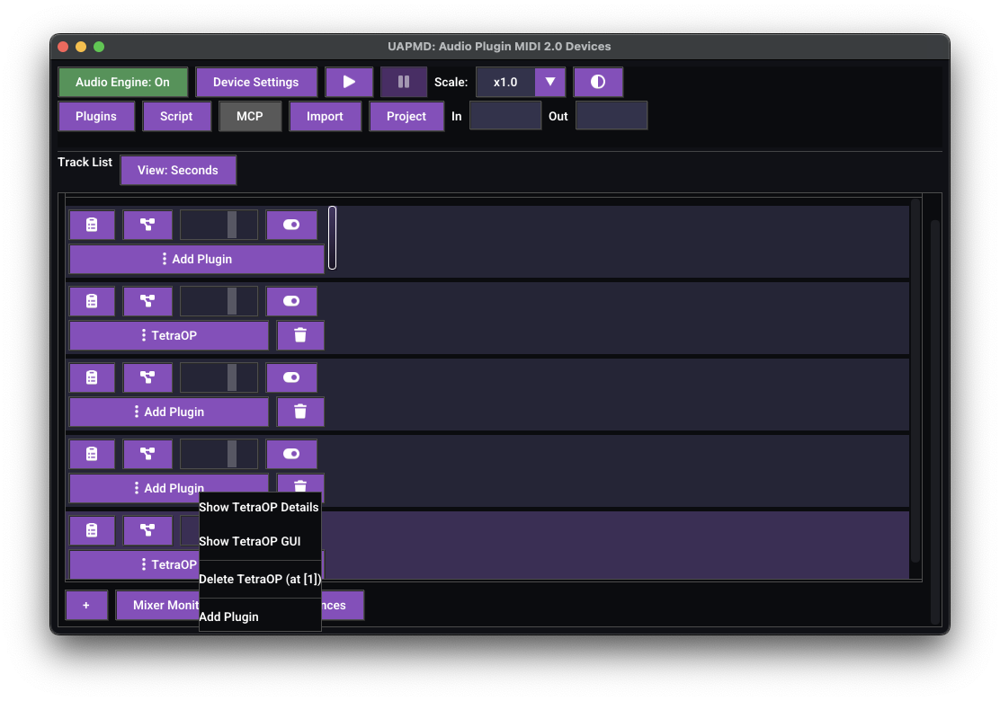
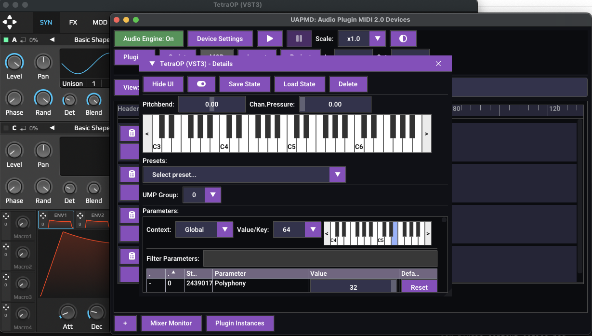

# UAPMD Users Guide

uapmd-app is primarily an audio plugin host which is demonstrating various audio plugin features in a DAW-like sequencer, to demonstrate how uapmd (library) and its feature is usable.
It runs on desktop (Windows / macOS / Linux), Android, iOS (tested only on simulators / rarely tested), and Web. It features:

- overall audio plugin hosting
  - and register them as virtual MIDI 2.0 UMP devices.
- multi-track sequencing of audio and MIDI 2.0 clips, over simple linear audio plugin graph
  - can import MIDI 1.0 SMF (translated to MIDI2 clips) and audio files into split tracks (source separation)
- save as a project (of audio and MIDI 2.0 sequences) and load ones
- manipulates all using JavaScript and MCP endpoints
- document edit model that should be capable enough to handle ARA2.

(Screenshots might be outdated, but they would still mostly make sense.)

## General Notes

Please bear in mind that UAPMD is still under heavy development.
There are still some features that do not work as expected. It is not much tested (there is no decent testable environment that sets up plugins on the CI server).

UAPMD is NOT a quality DAW project - it aims to provide DAW sequencer engine capacity.
Building an entire DAW requires much more. We provide ways to combine your individual audio and MIDI 2.0 clips and play them as a music project.
You find ways to create the individual items, and/or "build your own DAW" on top of UAPMD sequencer engine (which is rather like developers' activity).

## Prepare

### set up audio plugins you want to use

On desktop, uapmd-app makes use of audio plugins in VST3/AU/LV2/CLAP format, so just install whatever you would like to use.
There may be plugins that do not work with uapmd-app, but it's hard to tell in prior.
We have some list of working and not-working plugins on [the wiki page](https://github.com/atsushieno/uapmd/wiki/KnownToWork).

You can find some open source audio plugins by using [StudioRack](https://studiorack.github.io/studiorack-site/) (just note that there are instrument files that uapmd-app does not directly support).

On Android: find existing plugins from The AAP (Audio Plugins For Android) Project, using [Obtainium](https://obtainium.imranr.dev/) or [AAP APK Installer](https://github.com/atsushieno/android-ci-package-installer).
You can search "aap-" in the Obtainium's search box to find the plugin apps.
Note that you will have to dare to install from "untrusted" sources (they are @atsushieno's projects, totally built on GitHub Actions, which is completely transparent to everyone).

On Web: we only have limited plugins that are explicitly listed on the sources, so you don't have to do anything here.

## The main sequencer

UAPMD is a multi-track sequencer that processes audio and MIDI sequences.
When you launch `uapmd-app`, what you will see first is the main sequencer track list.

A track is bound to an audio graph.
You usually have one instrument plugin and zero or more effect plugins for MIDI clip tracks, or just zero or more effect plugins for audio clip tracks.

A track can contain both audio and MIDI 2.0 clips.
You usually want either of them, but if you want to apply automation on effect plugins on audio clips, you can create a track with an audio clip that contains the audio file, and a MIDI 2.0 clip that contains automation Assignable Controllers.

On playback, those audio and MIDI 2.0 "inputs" are both processed as input to the audio graph, sliced and passed per sample block.

### Set up tracks and clips

UAPMD initially launches with a few empty tracks.
You can either import MIDI 2.0 Clip Files (`*.midi2`), MIDI 1.0 SMF files (`.mid`) or audio files (`.wav`, `.ogg`, `.flac`).

Audio files can be imported as multiple, source-separated tracks (we have built-in Demucs support).
To use it, however, you have to provide a model file by yourself. Check [demucs.cpp project README](https://github.com/sevagh/demucs.cpp) and find links to their HuggingFace repo.

In either import, they don't come up with any plugins, so the next step is to apply audio plugins to each track.
(For split track you may not need any.)

## The plugin list

When UAPMD is launched, it will first perform "fast plugin scanning" that does not involve instantiating the plugins.
CLAP, LV2, AUv2, AUv3, and VST3 that contains moduleinfo.json do not involve instantiation.
Once `uapmd-app` is launched, press `Plugins` button to see what are available:

(The fast plugin scanning is always performed, as it is supposed to be fast enough - CLAP plugin scanning is still problematic in theory, but fortunately there is not a lot of CLAP plugins in the market to cause problems in practice.)

Many VST3 plugins do not support fast scanning; they don't show up until you perform "Scan Plugins".
It will launch a plugin scanner in another process (on desktop).

## Plugin instance details

Once you found a plugin that you want to use on the plugin list, you can select it and "Instantiate Plugin".
A new track will be added.
(You might find find existing tracks in the way - you can delete them.)
If you press the plugin name button ("Serum 2" in the screen shot below), it shows some options.

If you choose "Show [plugin name] Details", it shows its playground window.
You can also show the plugin UI there.

It would give you some feeling like you were using it on a DAW.
