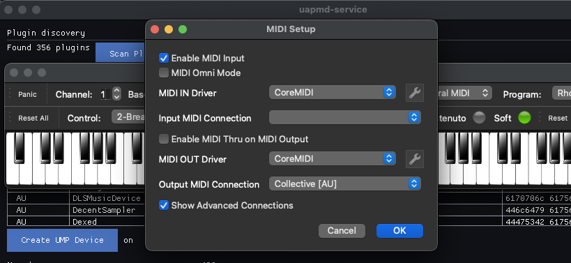
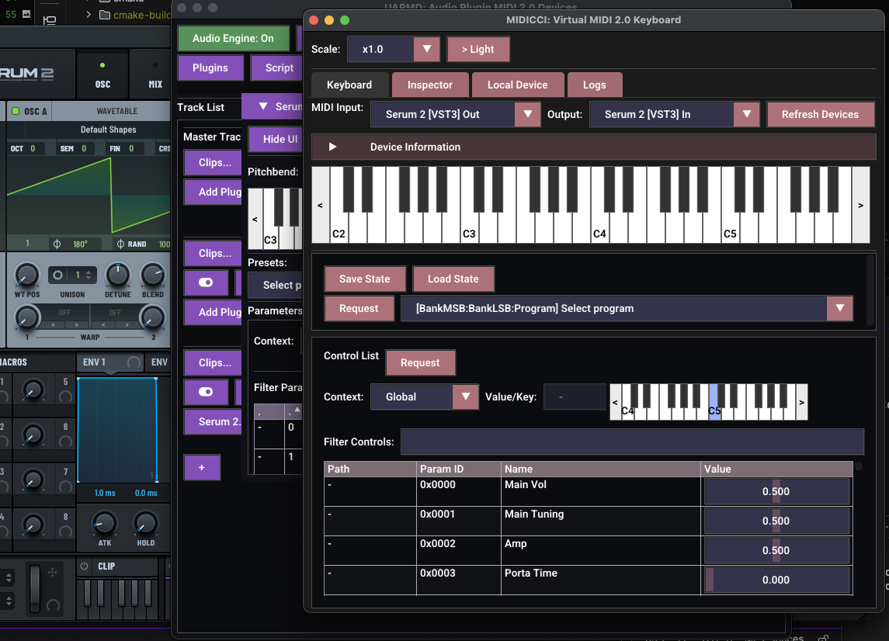

# How to make use of MIDI 2.0 apps with uapmd-app

Among many other features, UAPMD can register virtual MIDI 2.0 devices from audio plugin instances if the platform supports virtual MIDI 2.0 device registration.

Android does not support platform-level dynamic virtual MIDI 2.0 endpoints; instead, those AAP plugins directly registers virtual MIDI 2.0 devices without UAPMD (if its MIDI device service is set up appropriately).

## Prepare

To use an audio plugin as a virtual MIDI 2.0 device, you have to first instantiate it on a track on uapmd-app.

Any plugin type works i.e. it is not limited to instruments.

## Connect your app to the virtual device as a client

Those devices show up if your platform supports virtual MIDI 2.0 devices:

- macOS: they will show up either as MIDI 1.0 or MIDI 2.0 devices via CoreMIDI
- Linux: if you specify PIPEWIRE as the MIDI API, they will show up to its
  client. Otherwise, they show up as UMP devices to ALSA sequencer.

Note the behavioral differences between macOS and Linux.
On Linux there is no automatic converted registration to MIDI 1.0 devices list.
Only MIDI 2.0 clients list them. There are not many.

For example, if you launch [VMPK](https://vmpk.sourceforge.io/) on macOS (which supports automatic translation to MIDI 1.0 from UMP) and configure MIDI connection, there is a new MIDI device:

Now you can play your audio plugin as a MIDI device.

(Note that VMPK is a MIDI 1.0 application that does not find UMP devices on Linux.)

If you want to try UMP native keyboard on Linux, you can try my `midicci-app` app from [atsushieno/midicci](https://github.com/atsushieno/midicci/) GitHub repo. They have Linux packages and Homebrew setup.

It can retrieve parameters metadata and presets from the UMP device too, if you select both input and output from the same device (from the same plugin), IF everything works well, you'll see like this:

Note that changing parameter values often does not work fine yet.
